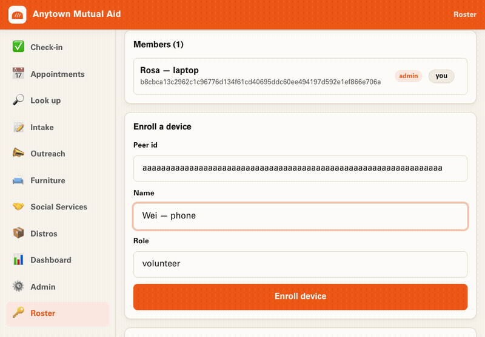
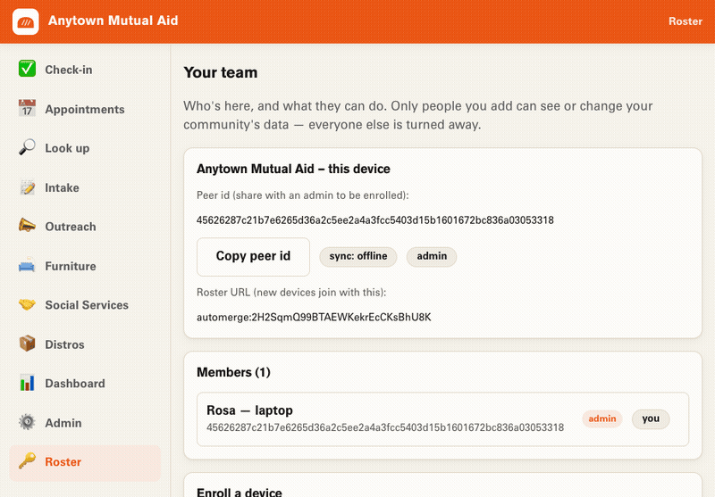

# Invite people & manage your team

A mutual-aid distribution is a team effort. This is how you bring people in and
decide who can do what — clearly, and without a company standing in the middle.

Everything here lives on the **Your team** screen (the *Roster*). Open it from
the nav.

## Who can do what

There are two roles:

- **Admin** — can do everything, *plus* manage the team: invite people, change
  roles, and remove access.
- **Volunteer** — can do the day-to-day work (intake, check-in, outreach, look
  up) but can't change who's on the team.

The person who creates the org is the first admin. Only people you add can see
or change your community's data. Everyone else is turned away — automatically,
on every device.

## Add a volunteer (the easy way: a QR code)

You don't need anyone's technical details. You hand them a code, they scan it,
they're in. For a quick walkthrough from **both** sides — admin and volunteer —
see [Onboard a volunteer with a QR code](onboard-a-volunteer.md).

1. On **Your team**, open the **QR invite** card.
2. Give the invite a name (e.g. *July distro volunteers*), and optionally set
   how long it lasts and how many people can use it.
3. Show the QR code (or copy the link and send it).
4. Your volunteer opens it on their phone, types their name, and taps **Join**.
   They're added as a **volunteer**, ready to work.

An invite is like a key: anyone who has it can join as a volunteer while it's
valid. Keep them short-lived, and **revoke** any invite you no longer want used
— people who already joined stay; no new devices can use that code again.

> Admin access is never handed out by QR. Invites only ever add volunteers. You
> promote someone to admin yourself, on purpose (below).

## Add a device by its key (the manual way)

If someone reads you their device's key (shown on their welcome screen), you can
add them directly from the **Enroll a device** card: paste the key, pick a role,
enroll. Useful for a second admin, or when you'd rather not use a QR code.

## Manage access

On each person in the **Members** list, an admin has one-tap controls:

| Action | What happens |
| --- | --- |
| **Make admin** | Promotes a volunteer to admin. They can now manage the team too. |
| **Make volunteer** | Steps an admin back down to volunteer. |
| **Revoke** | Removes a device's access. It can no longer see or change anything. |
| **Reinstate** | Brings a revoked device back. |

Two guardrails keep you from locking yourself out:

- You can't act on **your own** device from the list.
- You can't remove or demote the **last admin** — there's always at least one
  person who can manage the team.

## Sharing your org across devices

Everything above works offline on one device. To share one org across a phone
and a laptop, or between two volunteers, the devices need to reach each other.
Two ways:

- **Same org, same device pair:** a device joins with the **Roster URL** (shown
  on Your team) plus a relay address.
- **A relay** is a small connector that passes your (already-private) updates
  between devices. Point everyone at a shared community relay, or run your own.

**A word on trust:** a relay only shuttles messages between devices you've
already put on the roster — it can't read or change your data on its own. Even
so, for anything sensitive, run your own relay rather than a shared one you
don't control. Your community, your infrastructure.

---

Next: [Run a distribution →](run-a-distribution.md)
