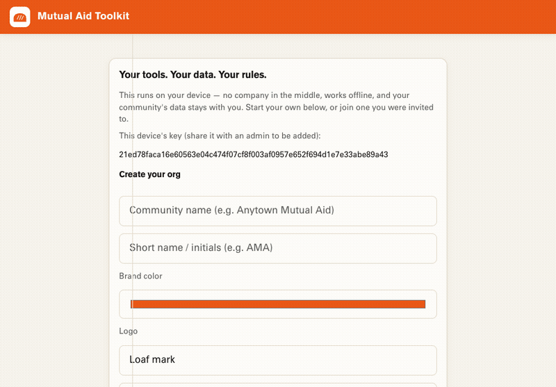

# Make it your own

This toolkit is a shell. The name on the door, the colors, the logo, and the
list of things you actually hand out — those are yours to set. You do it once,
when you start your org, and it travels to every device on your team.

There's no config file to edit and nothing to rebuild. Your community's
identity lives inside your own copy of the data, right next to the people and
requests.

## Start your org

Open the app and choose **Create a new org on this device**. You'll set:

| Field | What it does |
| --- | --- |
| **Community name** | Shows in the top bar and the browser tab, e.g. *Anytown Mutual Aid*. |
| **Short name / initials** | Used for the little logo chip if you pick the *Initials* logo, e.g. *AMA*. |
| **Brand color** | Recolors the whole app — the top bar, buttons, highlights. Pick your color. |
| **Logo** | *Loaf mark* (the default), *Initials chip* (your short name), or *No logo*. |
| **Your device name** | So your team knows whose device this is, e.g. *Rosa — laptop*. You become the first admin. |

Hit create. The app immediately wears your colors and name. Anyone you invite
sees the same thing — the identity is shared with the rest of your data.

## Change what you hand out

Out of the box the toolkit ships with a full mutual-aid catalog — food,
toiletries, household goods, furniture, kitchen items, social services, and a
dozen languages. That's a starting point, not a straitjacket. **Your catalog is
yours to define.**

Every community gives out different things. A food pantry, a clothing drive,
and a tenants' union all need different request types. The catalog is a plain
list of:

- **Goods** — the physical things people can request (each with a category like
  *food* or *furniture*).
- **Social services** — the help people can ask for (legal aid, tutoring,
  interpretation…).
- **Languages** — the languages your neighbors actually speak, so intake and
  outreach happen in their words.

The default lives in [`src/catalog.json`](../src/catalog.json). To ship a copy
of the toolkit with a different catalog, edit that file, and your build carries
your list. (Per-org catalog editing from inside the app is on the roadmap —
today the catalog is baked into your copy at build time, while name/colors/logo
are set live when you create your org.)

## Keep the words you use

The app talks in plain terms on purpose — *your team*, *check in*, *look up*,
*mark delivered*. If your community uses different words (members, guests,
recipients, neighbors), the view files under
[`web/console/views/`](../web/console/views/) are small, dependency-free
JavaScript. Change a label, rebuild, done.

## Make it fully yours

Because you own your copy, nothing here is off-limits:

- Swap the **typeface** (the default is Bread's *Pogaca*) in
  [`web/console/fonts.css`](../web/console/fonts.css) and
  [`web/console/styles.css`](../web/console/styles.css).
- Change the **default theme** colors in `styles.css` (`:root`), or leave them
  and just pick your color when you create your org.
- Rename the whole thing. It's your tool now.

Then publish your copy — see **Run your own copy** in the
[README](../README.md).

---

Next: [Invite people & manage your team →](invite-and-manage.md)
