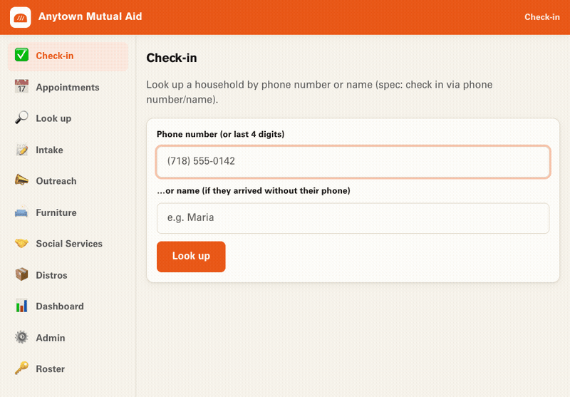

# Run a distribution

This walks through a distribution end to end — from someone asking for help to
handing it to them. Real people behind every number.

## 1. Intake — people ask for what they need

Open **Intake**. Fill in who they are (name, phone, the languages they speak)
and what they need — pick from your goods, kitchen and furniture items, and
social services. Furniture and large items can take a delivery address.

Each submission becomes a household with open requests, ready for the next
distribution. People can ask again later; their history stays with them.

## 2. Outreach — tell people it's happening

Open **Outreach** to build your call list and send a message.

1. **Build the list** — filter by what people requested, the languages they
   speak, and how recently you last texted or saw them. You get a checklist of
   who to reach.
2. **Write the message** — one message for everyone, *or* a message per
   language. Type Spanish, Cantonese, and English versions and each household
   gets the one they'll understand. `[FIRST_NAME]` and a link to your request
   form get filled in automatically.
3. **Book appointments** or record how a call went, right from the list.

Everyone gets reached in the language they speak — nobody left out because of
the words on the page.

## 3. Check-in — at the distribution

Open **Check-in**. This is the busy-day screen, built to be fast.

1. **Find them.** Type the **last 4 digits** of their phone (or their name).
   One match loads them; several let you pick.
2. **Go through their open requests.** For each thing they asked for:
   - They got it → **mark it delivered**.
   - They don't need it anymore → **mark it timed out**.
   - You're out of stock → leave it open; the request stays on their household
     record, so it shows up next time you build an Outreach list for that item.
3. **Check them in** once you've gone through everything.

At the end of the event, the **Distros** screen helps you mark no-shows so
follow-up stays honest.

## 4. Distros & no-shows

Open **Distros** to schedule an event, see who's booked, and — when it's over —
run the no-show pass. People who didn't come are marked missed; after enough
misses their old requests time out, so the list reflects reality.

## 5. Dashboard — see the whole picture

Open **Dashboard** for the headline: how many open requests there are and what's
most needed, ranked. It's the community's needs at a glance, so you can plan the
next distribution around what people actually asked for.

---

Everything you just did lives on your own devices and syncs to your team. No
company saw any of it. This is solidarity, made practical — and it's yours.

Back to the [README](../README.md) · [Make it your own](make-it-your-own.md) ·
[Invite & manage](invite-and-manage.md)
